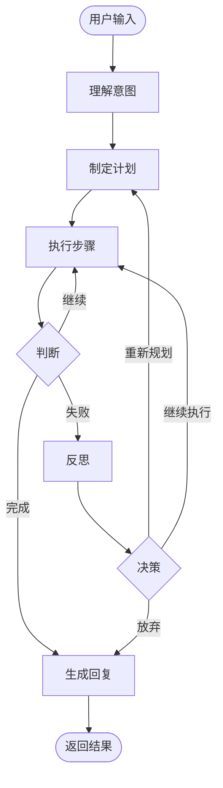

# LangGraph 集成说明

本文档详细说明了如何在桌面动物园项目中集成 LangGraph AI Agent。

## 架构概览

### 整体架构

```
用户界面 (PyQt6)
    ↓
主面板 (MainPanel)
    ↓
AI Agent (LangGraph) ──→ 工具层 (Tools) ──→ 功能模块 (Features)
    ↓                                            ↓
状态管理 (AgentState)                      新闻、闹钟等
    ↓
节点执行 (Nodes)
```

### LangGraph 状态图



## 核心组件

### 1. AgentState (状态定义)

位置: `agent/state.py`

定义了 Agent 在执行过程中的所有状态信息：

- `messages`: 对话历史
- `current_task`: 当前任务
- `plan`: 执行计划
- `steps_completed`: 已完成步骤
- `tool_results`: 工具调用结果
- `reasoning`: 推理过程
- `status`: 当前状态

### 2. Nodes (节点)

位置: `agent/nodes.py`

包含5个核心节点：

#### understand_intent
- 输入：用户的自然语言请求
- 处理：使用 Claude 理解用户意图
- 输出：任务描述

#### plan_task
- 输入：任务描述
- 处理：将任务分解为具体步骤
- 输出：步骤列表

#### execute_step
- 输入：下一步骤
- 处理：调用 LLM 决定使用哪个工具，执行工具
- 输出：执行结果

#### reflect_and_decide
- 输入：失败的执行结果
- 处理：分析失败原因，决定下一步行动
- 输出：决策（重新规划/继续/放弃）

#### respond_to_user
- 输入：所有执行结果
- 处理：生成友好的回复
- 输出：最终回复

### 3. Tools (工具层)

位置: `agent/tools.py`

使用 `@tool` 装饰器将功能包装为 LangChain 工具：

```python
@tool
def get_news() -> dict:
    """获取今日热点新闻"""
    # 调用 NewsFeature
    pass

@tool
def set_timer(minutes: int) -> dict:
    """设置倒计时闹钟"""
    # 调用 TimerFeature
    pass
```

### 4. Graph (工作流)

位置: `agent/graph.py`

定义节点之间的连接和条件转换：

```python
workflow = StateGraph(AgentState)
workflow.add_node("understand", understand_intent)
workflow.add_node("plan", plan_task)
workflow.add_node("execute", execute_step)
# ...

workflow.add_conditional_edges(
    "execute",
    should_continue_execution,
    {"execute": "execute", "reflect": "reflect", "respond": "respond"}
)
```

## 执行流程示例

### 场景：用户说 "帮我看看新闻然后定个闹钟"

```
1. [understand] 理解意图
   LLM分析: 用户想要 (1)查看新闻 (2)设置闹钟
   
2. [plan] 制定计划
   步骤1: 获取今日热点新闻
   步骤2: 设置10分钟闹钟
   
3. [execute] 执行步骤1
   LLM选择工具: get_news()
   调用工具 → 返回新闻列表
   
4. [判断] 成功，继续下一步
   
5. [execute] 执行步骤2
   LLM选择工具: set_timer(minutes=10)
   调用工具 → 设置闹钟
   
6. [判断] 所有步骤完成
   
7. [respond] 生成回复
   "主人！我已经帮你获取了今日新闻，并设置了10分钟的闹钟 ⏰"
```

## 如何添加新工具

### 步骤1: 创建功能模块（可选）

如果是新功能，先在 `features/` 下创建：

```python
# features/weather/weather_feature.py
from features.base_feature import BaseFeature

class WeatherFeature(BaseFeature):
    def get_name(self) -> str:
        return "weather"
    
    def get_button_text(self) -> str:
        return "查看天气"
    
    def execute(self) -> dict:
        # 实现天气查询
        return {"success": True, "message": "今天晴天"}
```

### 步骤2: 包装为工具

在 `agent/tools.py` 中添加：

```python
from features.weather.weather_feature import WeatherFeature

_weather_feature = WeatherFeature()

@tool
def get_weather(city: str = "北京") -> dict:
    """获取指定城市的天气信息
    
    Args:
        city: 城市名称，默认北京
        
    Returns:
        dict: 包含天气信息的字典
    """
    # 这里可以传递参数给 feature
    result = _weather_feature.execute()
    return result
```

### 步骤3: 注册到工具列表

在 `get_all_tools()` 中添加：

```python
def get_all_tools():
    return [get_news, set_timer, get_weather]  # 添加新工具
```

完成！Agent 会自动识别新工具并在需要时调用。

## 调试技巧

### 1. 打印状态

在节点中添加调试信息：

```python
def execute_step(state: AgentState) -> AgentState:
    print(f"当前状态: {state['status']}")
    print(f"计划: {state['plan']}")
    print(f"已完成: {state['steps_completed']}")
    # ...
```

### 2. 查看 LLM 输出

```python
response = llm.invoke(messages)
print(f"LLM回复: {response.content}")
```

### 3. 测试单个节点

```python
# 测试理解意图节点
test_state = {
    "messages": [HumanMessage(content="帮我看新闻")],
    # ... 其他字段
}
result = understand_intent(test_state)
print(result)
```

## 性能优化

### 1. 异步执行

主面板使用 `QThread` 在后台运行 Agent，避免 UI 卡顿：

```python
self.agent_thread = AgentThread(self.agent_graph, user_text)
self.agent_thread.finished.connect(self.on_agent_finished)
self.agent_thread.start()
```

### 2. 缓存

对于频繁调用的工具，可以添加缓存：

```python
from functools import lru_cache

@lru_cache(maxsize=10)
def get_news_cached():
    return get_news()
```

### 3. 超时控制

为 LLM 调用设置超时：

```python
llm = ChatAnthropic(
    model="claude-3-5-sonnet-20241022",
    timeout=30  # 30秒超时
)
```

## 常见问题

### Q: Agent 执行太慢怎么办？
A: 
1. 使用更快的模型（haiku）
2. 减少 LLM 调用次数
3. 简化节点逻辑

### Q: Agent 经常理解错误怎么办？
A: 
1. 优化 System Prompt
2. 提供更多示例
3. 使用更强的模型（opus）

### Q: 如何让 Agent 记住上下文？
A: 
1. 在 `AgentState` 中添加历史记录
2. 每次调用时传入之前的对话历史
3. 考虑使用向量数据库存储长期记忆

## 参考资源

- [LangGraph 官方文档](https://langchain-ai.github.io/langgraph/)
- [LangChain 工具使用](https://python.langchain.com/docs/modules/agents/tools/)
- [Anthropic API 文档](https://docs.anthropic.com/)
- [Claude Tool Use](https://docs.anthropic.com/claude/docs/tool-use)
